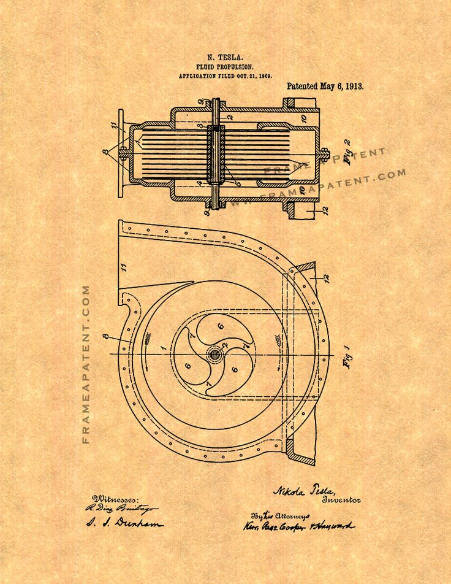

Работая над этим проектом, я построил масштабируемую архитектуру с использованием событийной модели и внедрил систему боя, UI, прогрессии и монетизации. Учитывая особенности WebGL, реализовал адаптивную загрузку и учёл ограничения браузеров по памяти и производительности. UI был спроектирован для корректной работы как на десктопе, так и на сенсорных экранах. Интеграция рекламных SDK и тестирование на всех целевых устройствах завершились успешной публикацией на Poki.

